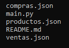

# PanCamp

Es un sistema de gestión integral que permite manejar todas las operaciones relacionadas con la administración de productos, proveedores, empleados, clientes, generando informes relevantes. 

## Descripción 

* Para realizar este sistema hice uso de los *.json* donde guardaba todos los datos de PanCamp
* Consta de un menu en las cuales puedes realizar ventas, comprar y ver informes ya sea de las ventas o de stock.
* El sistem consta de 4 funcionalidades:
    
    | ARCHIVO | FUNCIÓN |
    | --- | --- |
    | compras.json| Guarda todos los datos registrados a la hora de hacer una compra |
    | ventas.json | Guarda todos los datos registrados a la hora de hacer una venta |
    | productos.json | Contiene todos las categorias disponibles con su respectivo nombre y precio |
    | main.py | Realización del codigo |
    |

    ## Estructura 
     

    ## Lenguajes de uso 

     
    
    ## Instalación 

    1. Instalar visual code, git y python 
    2. Clonar repositorio 

    ## Creditos 

    Elaborado por Zully Fernanda Ortiz Avendaño 

